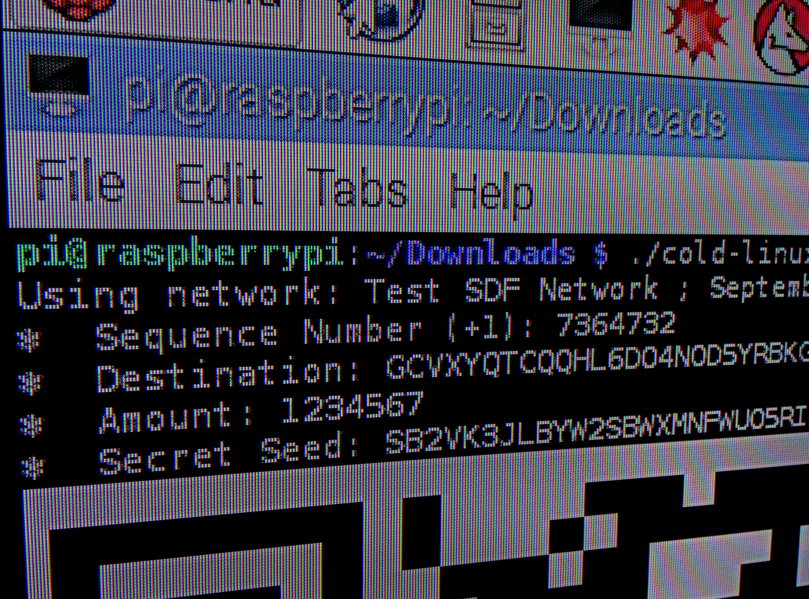
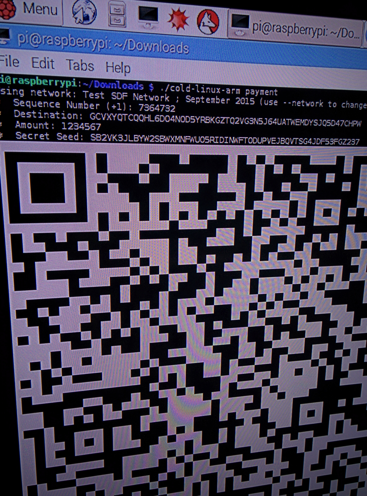

# :snowman: cold

Stellar cold wallet app built in Go. Features:
* Prints QR code with Transaction Envelope in console. :sparkles:
* You can run it on Raspberry Pi (and other ARM devices). :sparkles:
* Yeah, it can build transactions (right now only native [payment](https://www.stellar.org/developers/learn/concepts/list-of-operations.html#payment)).

**Warning!** This tool is still in development. **Always** create your transaction for `test` network first and then check it in [xdr-viewer](https://stellar.github.io/xdr-viewer/). Then create your transaction for `public` network, check it again (!!!) and then submit it to the network.

1 | 2
------------- | -------------
  | 


## Download
[Prebuilt binaries](https://github.com/bartekn/cold/releases) of the this tool are available on the [releases page](https://github.com/bartekn/cold/releases).

| Platform       | Binary file name                                                   |
|----------------|--------------------------------------------------------------------|
| Linux ARM      | [cold-linux-arm](https://github.com/bartekn/cold/releases)         |
| Linux 64 bit   | [cold-linux-amd64](https://github.com/bartekn/cold/releases)       |
| Mac OSX 64 bit | [cold-darwin-amd64](https://github.com/bartekn/cold/releases)      |
| Windows 64 bit | [cold-windows-amd64.exe](https://github.com/bartekn/cold/releases) |

Alternatively, you can [build](#building) the binary yourself.

## Usage
```
⛄  STELLAR COLD WALLET ⛄ 
  
* * * * * * * * * * * * *

Usage:
  cold [command]

Available Commands:
  payment     Creates a transaction with Payment operation

Flags:
  -h, --help             help for cold
  -n, --network string   [public|test] network to use (default "test")
  -s, --print-string     when set, transaction will be a string instead of QR code

Use "cold [command] --help" for more information about a command.
```

## Building

```
go get github.com/constabulary/gb/...
gb vendor restore
gb build
```
